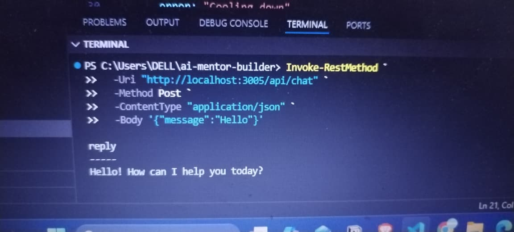
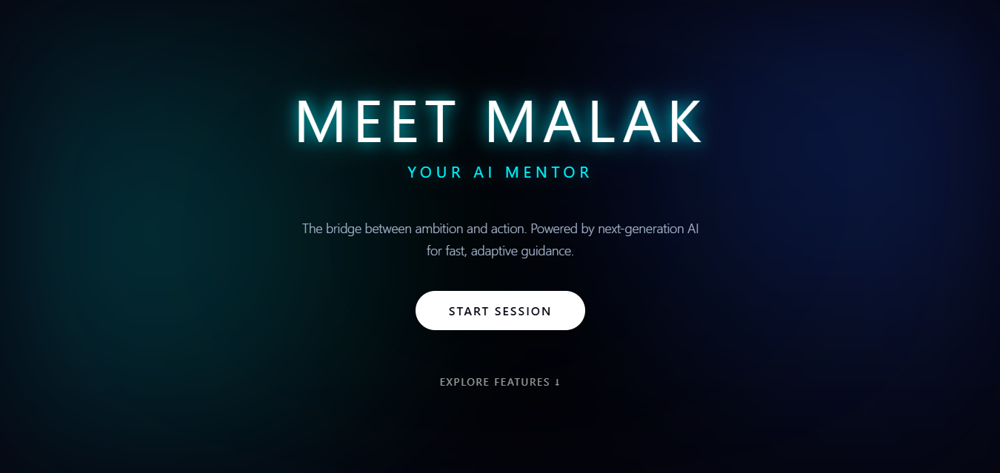
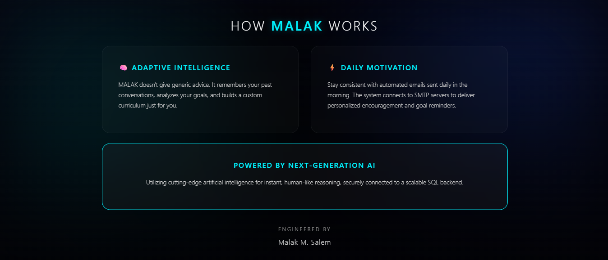
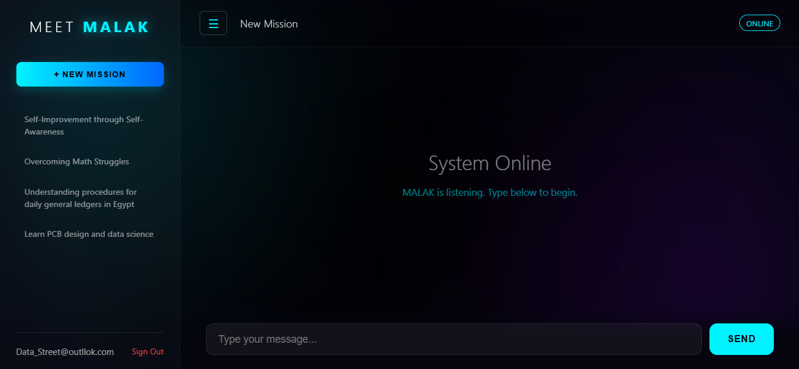

 

 

### `M.A.L.A.K — Mentor for Adaptive Learning & Knowledge`
 

 

 

 
 
It started in a terminal window.
No UI. No database. No memory system. Just an API call fired into the void and something actually talking back.

   
  
   

 

What you're looking at now is everything built after that moment: persistent vector memory, autonomous daily emails, session intelligence, a 3-tier memory classifier, and a full glassmorphism UI — all grown from one terminal reply.

---
 
 
## 'Demo'
 

 

 &nbsp; 
 

 
---
